# **Securely Analyze Data With AWS Lake Formation and Amazon QuickSight**

This lab is provided as part of **[AWS Innovate Data Edition](https://aws.amazon.com/events/aws-innovate/data/)**,  it has been adapted from an [AWS blog post](https://aws.amazon.com/blogs/big-data/securely-analyze-your-data-with-aws-lake-formation-and-amazon-quicksight/)

Click [here](https://github.com/phonghuule/aws-innovate-data) to explore the full list of hands-on labs.

ℹ️ You will run this lab in your own AWS account. Please follow directions at the end of the lab to remove resources to avoid future costs.

## Background
Many useful business insights can arise from analyzing customer preferences, behavior, and usage patterns. With this information, businesses can innovate faster and improve the customer experience, leading to better engagement and accelerating product adoption. More and more businesses are looking for ways to securely store and restrict access to customer data, which may include personally identifiable information (PII) and other sensitive information. Accessing customer data for use cases such as analytics and Machine Learning requires careful management of access permissions and the ability to audit usage.

This lab explores the ways in which you can securely store, analyze, and visualize sensitive customer data. We start by storing encrypted sample test data in our Amazon Simple Storage Service (Amazon S3) based data lake. We use AWS Lake Formation to configure fine-grained permissions to restrict user access, and finally analyze the data and visualize business insights using Amazon QuickSight.

## Pre-requisites
Before proceed with the lab, you should be familiar with the following:
- Amazon Athena
- AWS Glue
- AWS Identity and Access Management (IAM)
- Lake Formation
- QuickSight
- Amazon S3

## Architecture Overview
The following diagram illustrates our solution’s architecture.

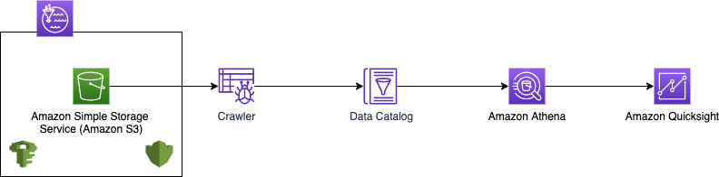

## Setup: Launch AWS CloudFormation Stack

You will use AWS CloudFormation to deploy Amazon SageMaker in your AWS account. It will be deployed in the **N.Virginia region**. Please ensure you follow directions at the end of the lab to delete the CloudFormation stack to remove resources.

**1.** Login to your AWS account.

**2.** Set administrative roles in [Lake Formation](https://console.aws.amazon.com/lakeformation/home?region=us-east-1#administrative-roles-and-tasks)

Select <b>Choose Administrator</b> and select the logged in IAM user as administrator and <b>Save</b>

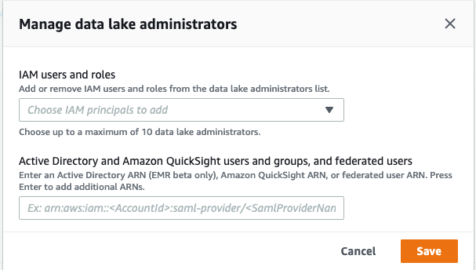

**3.** Launch the CloudFormation template by choosing Launch Stack

The CloudFormation console will be displayed, with some information already entered.
When you launch the template, enter values for the following parameters:
* <b>AdminPassword</b> – An initial password for the admin@example.com user
* <b>AnalystPassword</b> – An initial password for the analyst@example.com user
* <b>BucketNameParam</b> – A unique name to be used for the data lake bucket
* <b>CFNExecRoleOrUserArnParam</b> – An ARN of principal (user or role) executing CloudFormation stack. You can find ARN of logged in user from IAM
https://console.aws.amazon.com/iamv2/home#/users

## Configure Lake Formation

**1.** First, we use Lake Formation to create a central data lake repository on Amazon S3 to store and analyze your data:
* On the <b>Lake Formation</b> console, under <b>Data Catalog</b>, choose <b>Settings</b>
* <b>Deselect</b> the two check boxes associated with the Data Catalog using only IAM permissions
* <b>Save</b>

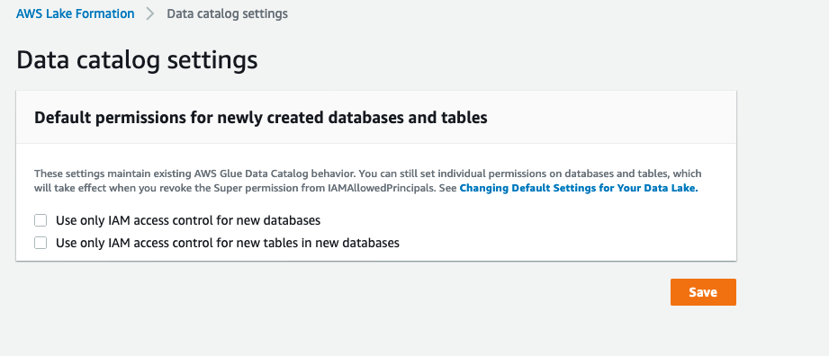

To maintain backward compatibility with AWS Glue, these settings are enabled by default for new Data Catalog resources. These settings effectively cause access to Data Catalog resources to be controlled solely by IAM policies. Deselect the permissions so that you can give individual permissions to Data Catalog resources from Lake Formation.

Next, we revoke generic IAM principal access to tables in our database. This makes sure that only permissions applied using Lake Formation will apply.

**2.** On the Lake Formation console, choose <b>Administrative roles and tasks</b>

**3.** Under Database Creators¸ select IAMAllowedPrincipals

**4.** Choose <b>Revoke</b>

**5.** For Catalog permissions, select Create database

**6.** Leave all other settings at their default and choose Revoke. 

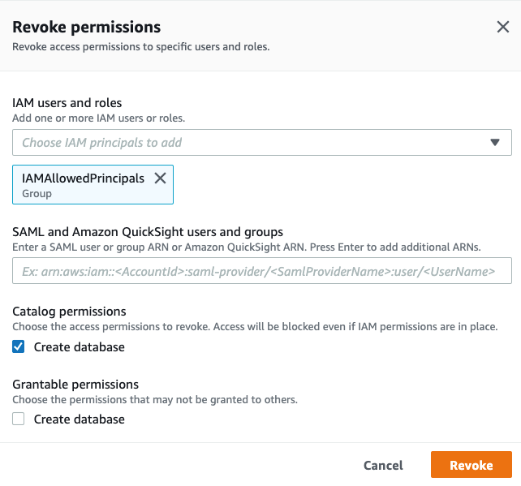

We now need to revoke permissions for IAMAllowedPrincipals.

**7.** On the Data permissions page, revoke all grants to the group IAMAllowedPrincipals

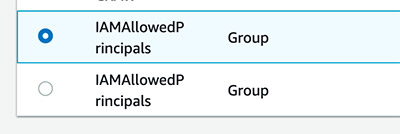

Lake Formation is now the single pane of glass for data governance within your data lake. To configure user permissions in Lake Formation, you must be a data lake admin. The CloudFormation template already created admin@example.com as our data lake admin. When you’re logged in as the admin, you need to grant them the ability to manage permissions for users.

**8.** On the IAM console, choose Users.

**9.** Choose the admin@example.com user.

**10.** On the Security Credentials tab, copy the link for that user to log in.

**11.** Open the link in a new browser or private browser window.

**12.** Reset the password (on your first login).

**13.** On the Lake Formation console, choose Data permissions.

**14.** Choose Grant.

**15.** Make sure the admin user has both database and grantable Super permissions on the db1 database.

**16.** On the Databases page, select the db1 database.

**17.** On the Actions menu, choose Edit.

**18.** Choose the S3 bucket created as part of the CloudFormation stack as the database location. 

The naming convention of the S3 bucket is <account_number><region_name><bucket_name>. For example, it should appear as similar to 111122223333virginiamybucketname. Do not choose the bucket name ending with athenaoutput.

**19.** Deselect Use only IAM access control for new tables in this database.

**20.** Choose Save.

After this step, if you see IAMAllowedPrincpals under Data permissions, follow the steps as explained before to revoke the permissions.

The next permission we want to grant is the ability for our AWS Glue execution role to create new tables in our db1 database:

**21.** On the Data permissions page, choose Grant.

**22.** For IAM users and roles, choose the AWS Glue role created as part of the CloudFormation stack.

**23.** For Database, choose the db1 database.

**24.** For Database permissions, select Create table.

**25.** Make sure that no options are selected for Grantable permissions.

**26.** Choose Grant.

Now that data lake admin is set up and Lake Formation is managing permissions, we can work on creating table definitions of cards, customers, and sales data into the Lake Formation Data Catalog. Let’s verify the files created by the CloudFormation template into S3 bucket folders.

**27.** On the Amazon S3 console, choose the bucket that you chose for the db1 location.

The following CSV files are in their respective folders cards, customers, and sales:
* cards.csv
* customers.csv
* sales.csv

Now that we’ve verified the files, let’s catalog it in the Lake Formation Data Catalog using AWS Glue crawlers.

**28.**  On the AWS Glue console, choose Crawlers. 
Select the crawler security-blog-crawler and choose Run crawler.

This crawler was created by the CloudFormation template. It can crawl multiple data stores like cards, customers, and sales to populate the Data Catalog.

After you run the crawler, you should see the tables in the Data Catalog. To view the tables, switch to the Lake Formation console, choose Databases, select the db1 database, and choose View tables.

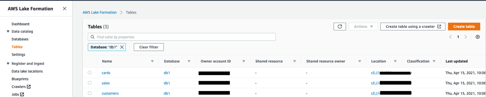

## Process the result set

Our dataset includes information about our customer demographics and references between customers that share credit cards when making purchases. We develop a simple job using PySpark to combine the purchasing user’s information with the cardholder. You can perform other transformations and enrichment such as masking sensitive fields or looking up additional details in external systems. When the job is complete, it outputs the data in columnar format to give us better performance and reduce cost when we later analyze it

Let’s run the ETL jobs to clean the cards and sales data. They create new files under the clean_cards and clean_sales S3 folders with the modifications. We start with cleaning the card data. The job replaces full card numbers with the last four digits of the card numbers and create a new file in the clean_cards folder.

**1.** Make sure you’re signed in as the data lake admin with username admin@example.com.

**2.** On the AWS Glue console, choose Jobs.
    
**3.** Select the job clean_cards_data and on the Action menu, choose Run job.
    
**4.** Expand Security configuration, script libraries, and job parameters.
    
**5.** Under Job parameters, add the key --output_s3_bucket_name and the value as the bucket name that contains the CSV files. 
You can navigate to [Amazon S3](https://s3.console.aws.amazon.com/s3/home?region=us-east-1&region=us-east-1) to get the bucket's name, it should be in this format - 292695198383virginiasecurelfblog
    
**6.** Choose Run job.

Next, we clean up our sales data. The dollar amounts for the purchase prices are casted as strings with a dollar sign ($) in them. To make analytics easier downstream, we want to have those casted as decimals without the dollar signs.

**7.** Follow the same procedure to run the clean_sales_data

Now that we have generated our clean cards and clean sales data in the S3 bucket, we run security-blog-crawler to add the clean cards and clean sales tables to our Data Catalog.

**8.** In the navigation pane, choose Crawlers.
    
**9.** Select the crawler called security-blog-crawler and choose Run crawler.

Now that we have our new tables with masked card data and cleaned sales data, you grant the analyst user permission to access it in Lake Formation.

**10.** On the Lake Formation console, grant the Select permission to the clean_cards and clean_sales tables for the user analyst@example.com.

This completes the permissions scope for the analyst user.

## Enable fine-grained permission for QuickSight users
To enable fine-grained permissions for viewers, you must first add them to a QuickSight group that can be configured in Lake Formation with fine-grained permissions. For this post, we create the QuickSight user analyst@example.com.

**1.** Sign in to your AWS account with the admin user (not the Lake Formation admin user).

**2.** In a new tab, open the QuickSight console.

**3.** Choose the logged-in user and choose Manage QuickSight.

**4.** Add the user analyst@example.com with the author role.

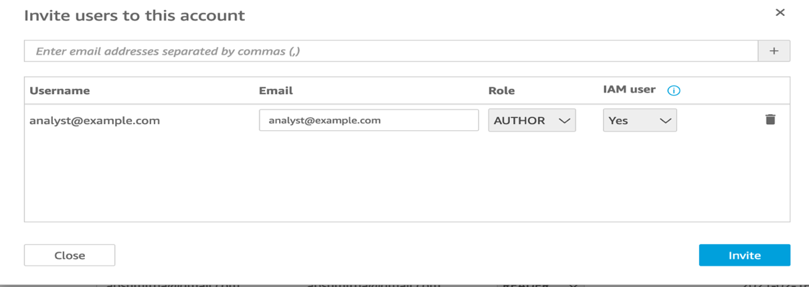

Now we create the QuickSight group Analyst and add the QuickSight user analyst@example.com to the group. We use the [AWS Command Line Interface (AWS CLI)](https://aws.amazon.com/cli/) for this purpose.

**5.** Run the following command to create the group (provide your account ID): 

aws quicksight create-group --aws-account-id=<account_id> --namespace=default --group-name="Analyst" --description="Data Analyst Group"

**6.** Run the following command to add the user to the group: : 

aws quicksight create-group-membership --group-name 'Analyst' --aws-account-id <account_id> --namespace default --member-name=analyst@example.com

**7.** Run the following command to get the ARN of the QuickSight group: 

aws quicksight describe-group --group-name=Analyst --aws-account-id <account_id> --namespace=default

**8.** Make a note of this ARN.

We use this ARN to configure access permissions to this QuickSight group in Lake Formation.
Because we configured the data lake bucket and Athena output bucket with CMKs, we need to grant the following key operations to the QuickSight role.

**9.** Sign in with the admin@example.com

**10.** On the Lake Formation console, choose Data permissions. Choose Grant.

**11.** For SAML and Amazon QuickSight users and groups, enter the Analyst group ARN you copied earlier.

**12.** For Database, choose db1.

**13.** For Tables, choose clean_cards and clean_sales.

**14.** For Table permissions, select Select. Choose Grant.

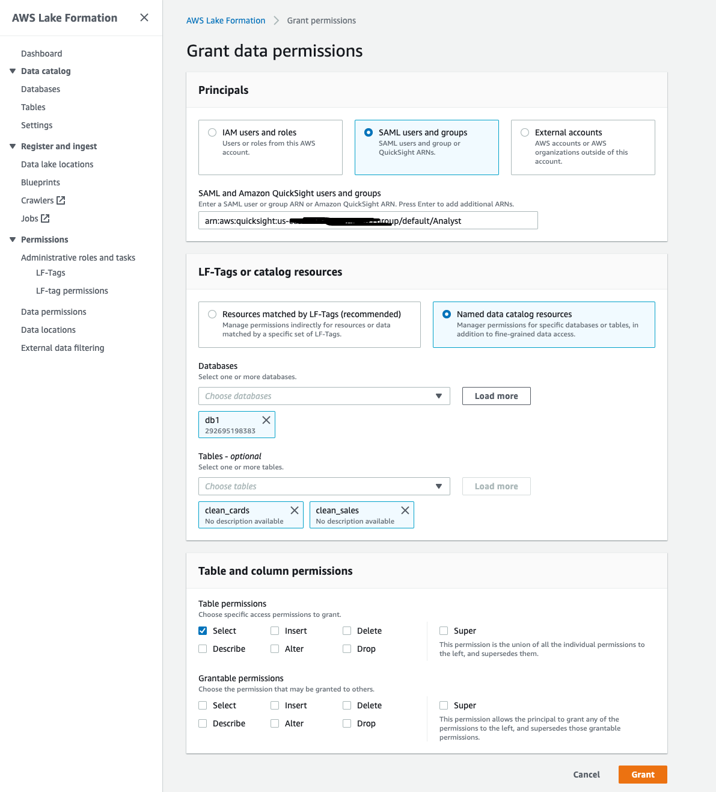

Now let’s grant permissions to the customers table by excluding the address and email fields.

**15.** On the Data permissions page, choose Grant.

**16.** For SAML and Amazon QuickSight users and groups, enter the Analyst group ARN you copied earlier.

**17.** For Database, choose db1.

**18.** For Tables, choose customers.

**19.** For Columns, choose Exclude columns.

**20.** For Exclude columns, choose address and email.

**21.** For Table permissions, select Select.

**22.** Choose Grant.

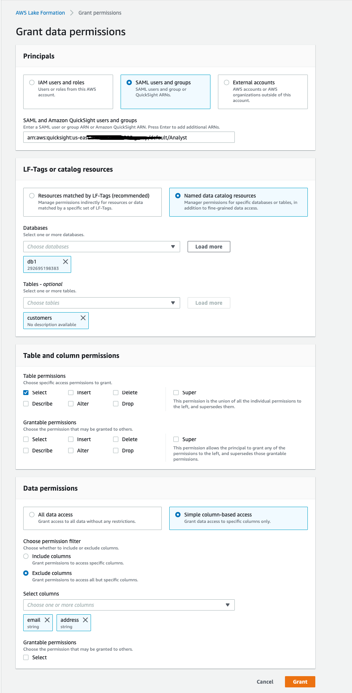

## Visualize data ##

In our use case, we logically grouped our users and cardholders into a columnar format in preprocessing, which we can now use to sort through and derive value. In QuickSight, we use the heat map visualization to map the buyer to the number of times they used someone else’s credit card. This gives us a visual of which users used different credit cards the most.

**1.** Sign in using analyst@example.com.

**2.** On the QuickSight console, choose New analysis.

**3.** Choose New datasets.

**4.** For Create a Dataset, choose Athena.

**5.** Enter ABCCompany Analysis as the data source.

**6.** Choose Create data source.

**7.** Choose the database db1.

As shown in the following screenshot, you’re only shown the table permissions granted to the QuickSight Analyst group.

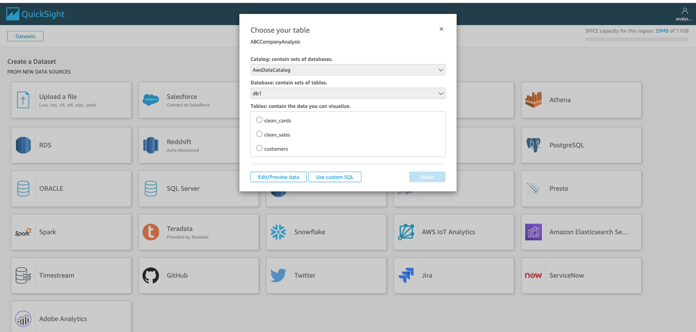

**8.** Choose Use custom SQL

**9.** Enter the query name as Sales-Cards-Query

We now run queries to verify that the analyst user doesn’t have access to the cards and sales tables.

**10.** Enter the following query for the cards table:

    SELECT * from "db1"."cards"

The following screenshot shows that we get a permission error.

**11.** Similarly, you can verify the permissions for sales table by running following query. You should see the same permission error as for the cards table.

    SELECT * from "db1"."sales"

**12.** Enter the following query for the customers

    SELECT * from "db1"."customers"

The following screenshot shows that the analyst only has access to customer fields other than address and email.

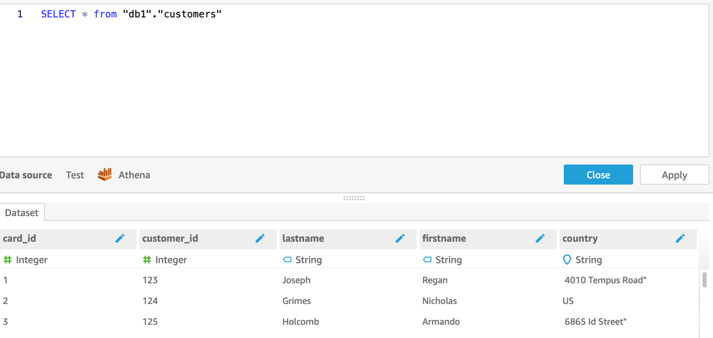

The analyst only has access to the clean_sales, clean_cards, and customers tables (excluding the address and email fields).

**13.** Enter the following SQL and choose Edit/Preview Data: 

    SELECT "db1"."clean_sales"."customer_id", COUNT("db1"."clean_sales"."customer_id") as num_diff_card_used FROM "db1"."clean_sales" JOIN "db1"."customers" ON "db1"."clean_sales"."customer_id"="db1"."customers"."customer_id" AND "db1"."clean_sales"."card_id" != "db1"."customers"."card_id" GROUP BY "db1"."clean_sales"."customer_id" ORDER BY num_diff_card_used DESC

The following screenshot shows our query results.

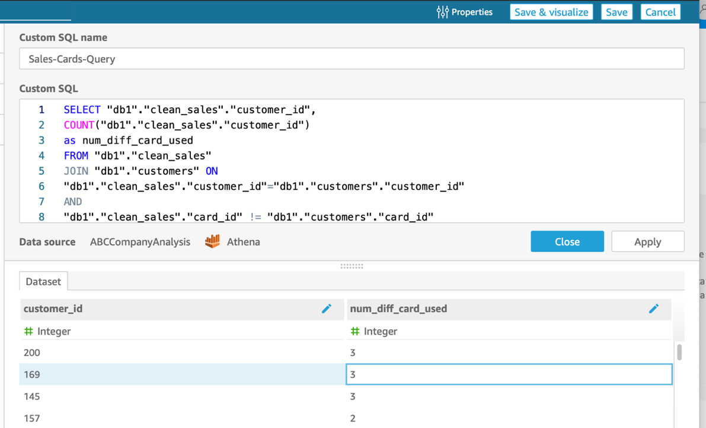

**14.** Choose Save & visualize to create a visualization.

**15.** Choose + Add and choose Add visual.

**16.** Choose the heat map visual type.

**17.** Set Rows to customer_id.

**18.** Set Columns and Values to num_diff_card.

**19.** On the Values drop-down menu, choose Aggregate sum.

The following screenshot shows our QuickSight analysis. You can change the color by choosing Format visual.

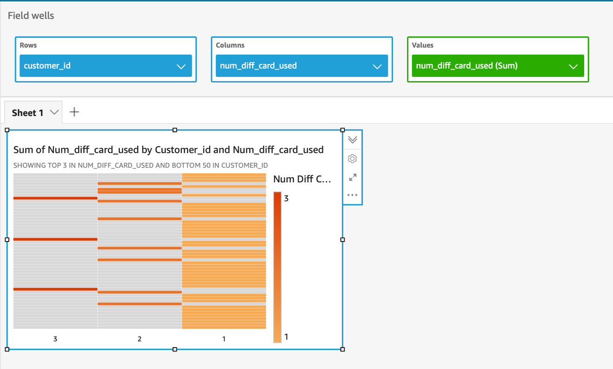

From this visualization, we can see that several customers are making purchases with more than one card that they don’t own. We can also add further visualizations that add more context to our data like customer IDs and the total number of purchases made with cards that customers don’t own.

The following are some of the additional datasets and visualizations that you can add to your analysis.

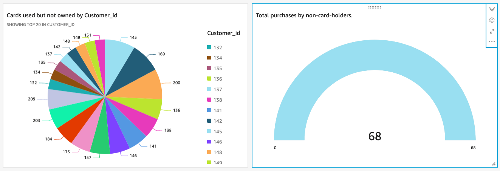

This data may provide valuable insights into the relationships between users and also provide a starting point for forensic investigations into customers that may be making fraudulent purchases.

## Clean up

When you’re done with this exercise, complete the following steps to delete your resources and stop incurring costs:

1. On the Amazon S3 console, delete the objects in the buckets created by the CloudFormation stack.
2. On the CloudFormation console, select your stack and choose Delete.

This cleans up all the resources created by the stack.

3. Cancel your QuickSight account.
